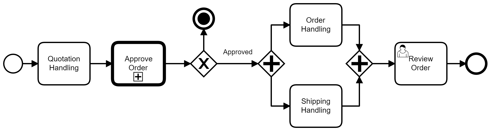

# Di'Lanches

**Eduardo Augusto Brito, 1397390@sga.pucminas.br**

**Eron Panes de Moraes, epmoraes@sga.pucminas.br**

**Pablo Guilherme A.P Magela, pablo.amancio@sga.pucminas.br**

**Guilherme Augustto Costa Barros, 1334415@sga.pucminas.br**

**Henrique Pinto Santos, henrique.santos.1267265@sga.pucminas.br**

**José Miguel Quintão Magalhães, jmqmagalhaes@sga.pucminas.br**

---

Professores:

**Cristiano Geraldo Teixeira Silva**

**Felipe Augusto Lima Reis**

**Hugo Bastos de Paula**

---

_Curso de Engenharia de Software, Unidade Praça da Liberdade_

_Instituto de Informática e Ciências Exatas – Pontifícia Universidade de Minas Gerais (PUC MINAS), Belo Horizonte – MG – Brasil_

---

Com o avanço da Tecnologia, a maioria das coisas ao nosso redor se tornou de fácil acesso e com muito mais conforto. Uma dessas coisas é o sistema de Delivery. Com o 
objetivo de facilitar o acesso a diversos tipos de comida em sua própria residência com apenas um smartphone. Porém, sabemos que às vezes uma nova tecnologia sofre com 
diversos problemas de processo e organização. Em um sistema de delivery, podemos pensar em problemas como: Pedido entregue errado, ingredientes faltantes no prato 
pedido, entrega demorada e falta de organização dos pedidos (ordem de abertura) na cozinha para a preparação.

Nosso objetivo é desenvolver um projeto que faça com que a solicitação de pedido seja feita de forma simples, e que garanta a qualidade da entrega e de produção mais 
viável possível, e que ponte entre o cliente e o fornecedor seja muito mais cômoda para ambos os lados. Entendemos que hoje a exigência por serviços de qualidade estão 
aumentando a cada dia, a avaliação de cada cliente seja um comentário ou uma avalição em notas, podem gerar impactos positivos ou negativos para uma determinada 
empresa, com isso os processos estão em constantes evoluções.

---

## 1. Introdução

Um estabelecimento onde são recebidos muitos pedidos dos clientes, requer muita organização da parte dos atendentes para 
que os pedidos não cheguem incorretos no setor de produção. Pensando nisso, nosso projeto tem como objetivo tornar o 
processo de gestão desses pedidos o mais simples, fácil e eficiente possível.

    1.1 Contextualização

O Di’Lanches é uma empresa que possui um software que permite os seus atendentes gerenciar e organizar os pedidos dos 
clientes, onde o(a) atendente gera códigos para os pedidos realizados, além disso o mesmo poderá selecionar o lanche, 
a forma de pagamento e se o cliente irá comer no local ou levar para a viagem.  

    1.2 Problema
    
Imaginamos que uma hamburgueria possui muitos pedidos e os atendentes não possuem um sistema bem organizado, 
e por esse motivo os pedidos chegam à cozinha incorretos, e como consequência geram problemas no controle de estoque, 
atrasos nas entregas e pedidos sendo entregues incorretamente.

    1.3 Objetivo geral

O Objetivo Geral desse Projeto será elaborar um sistema para pedidos de lanches de um restaurante, onde iremos priorizar 
a precisão no Controle de Estoque e o/a atendente do estabelecimento terá acesso a uma interface simplicada e de fácil uso.

        1.3.1 Objetivos específicos

O Projeto tem como Objetivo Específico criar uma Interface para o Sistema, de modo que o atendente consiga realizar 
os processo dos pedidos mais facilmente, e criar um Banco de Dados preciso para que informe sobre os Status dos 
produtos(Disponível, Em Falta, etc...).

    1.4 Justificativas

O Trabalho será desenvolvido com o intuito de facilitar o processo de pedidos de um restaurante, prezando pela qualidade, 
facilidade e agilidade no processo.

## 2. Participantes do processo

O participante do processo pode ser definido como restaurantes fast-foods. Empresas que possuem uma demanda alta de pedidos 
ao mesmo tempo e necessitam que os pedidos cheguem ao setor de maneira clara. 

## 3. Modelagem do processo de negócio

## 3.1. Análise da situação atual

Hoje em dia, muitos atendentes de fast-foods utilizam de formas ineficientes no controle de pedidos. Muitas vezes ocorre de o 
cliente realizar um pedido de algo que o restaurante está em falta, e só depois o atendente dar conta disso, causando conflitos.

## 3.2. Descrição Geral da proposta

Apresente aqui uma descrição da sua proposta abordando seus limites e suas ligações com as estratégias e objetivos do negócio. Apresente aqui as oportunidades de melhorias.

## 3.3. Modelagem dos Processos

### 3.3.1 Processo 1 – NOME DO PROCESSO

Apresente aqui o nome e as oportunidades de melhorias para o processo 1. Em seguida, apresente o modelo do processo 1, descrito no padrão BPMN.

### 3.3.2 Processo 2 – NOME DO PROCESSO

Apresente aqui o nome e as oportunidades de melhorias para o processo 2. Em seguida, apresente o modelo do processo 2, descrito no padrão BPMN.

## 4. Projeto da Solução

### 4.1. Detalhamento das atividades

Descrever aqui cada uma das propriedades das atividades de cada um dos processos. Devem estar relacionadas com o modelo de processo apresentado anteriormente.

#### Processo 1 – NOME DO PROCESSO

**Nome da atividade 1**

| **Campo** | **Tipo** | **Restrições** | **Valor default** |
| --- | --- | --- | --- |
| [Nome do campo] | [Área de texto, Caixa de texto, Número, Data, Imagem, Seleção única, Múltipla escolha, Arquivo, Link, Tabela] |  |  |
| ***Exemplo:***  |    |     |
| login | Caixa de Texto | formato de e-mail |  |
| senha | Caixa de Texto | mínimo de 8 caracteres |   |

**Nome da atividade 2**

| **Campo** | **Tipo** | **Restrições** | **Valor default** |
| --- | --- | --- | --- |
| [Nome do campo] | [Área de texto, Caixa de texto, Número, Data, Imagem, Seleção única, Múltipla escolha, Arquivo, Link, Tabela] |  |  |
|    |    |     |

#### Processo 2 – NOME DO PROCESSO

**Nome da atividade 1**

| **Campo** | **Tipo** | **Restrições** | **Valor default** |
| --- | --- | --- | --- |
| [Nome do campo] | [Área de texto, Caixa de texto, Número, Data, Imagem, Seleção única, Múltipla escolha, Arquivo, Link, Tabela] |  |  |
|    |    |     |

**Nome da atividade 2**

| **Campo** | **Tipo** | **Restrições** | **Valor default** |
| --- | --- | --- | --- |
| [Nome do campo] | [Área de texto, Caixa de texto, Número, Data, Imagem, Seleção única, Múltipla escolha, Arquivo, Link, Tabela] |  |  |
|    |    |     |

### 4.2. Tecnologias

Descreva qual(is) tecnologias você vai usar para resolver o seu problema, ou seja implementar a sua solução. Liste todas as tecnologias envolvidas, linguagens a serem utilizadas, serviços web, frameworks, bibliotecas, IDEs de desenvolvimento, e ferramentas. Apresente também uma figura explicando como as tecnologias estão relacionadas ou como uma interação do usuário com o sistema vai ser conduzida, por onde ela passa até retornar uma resposta ao usuário.

## 5. Modelo de dados

Apresente o modelo de dados por meio de um modelo relacional ou Diagrama de Entidade-Relacionamento (DER) que contemple todos conceitos e atributos apresentados item anterior. 

## 6. Indicadores de desempenho

Apresente aqui os principais indicadores de desempenho e algumas metas para o processo. Atenção: as informações necessárias para gerar os indicadores devem estar contempladas no diagrama de classe. Colocar no mínimo 5 indicadores.

Usar o seguinte modelo:

| **Indicador** | **Objetivos** | **Descrição** | **Cálculo** | **Fonte dados** | **Perspectiva** |
| --- | --- | --- | --- | --- | --- |
| Percentual reclamações | Avaliar quantitativamente as reclamações | Percentual de reclamações em relação ao total atendimento |   | Tabela reclamações | Aprendizado e Crescimento |
| Taxa de Requisições abertas | Melhorar a prestação de serviços medindo a porcentagem de requisições | Mede % de requisições atendidas na semana |  | Tabela solicitações | Processos internos |
| Taxa de entrega de material | Manter controle sobre os materiais que estão sendo entregues | Mede % de material entregue dentro do mês |   | Tabela Pedidos | Clientes |

Obs.: todas as informações para gerar os indicadores devem estar no diagrama de classe **a ser proposto**

## 7.Sistema desenvolvido

Faça aqui uma breve descrição do software e coloque as principais telas com uma explicação de como usar cada uma.

## 8. Conclusão

Apresente aqui a conclusão do seu trabalho. Discussão dos resultados obtidos no trabalho, onde se verifica as observações pessoais de cada aluno. Poderá também apresentar sugestões de novas linhas de estudo.

# REFERÊNCIAS

Como um projeto de software não requer revisão bibliográfica, a inclusão das referências não é obrigatória. No entanto, caso você deseje incluir referências relacionadas às tecnologias, padrões, ou metodologias que serão usadas no seu trabalho, relacione-as de acordo com a ABNT.

Verifique no link abaixo como devem ser as referências no padrão ABNT:

http://www.pucminas.br/imagedb/documento/DOC\_DSC\_NOME\_ARQUI20160217102425.pdf

**[1.1]** - _ELMASRI, Ramez; NAVATHE, Sham. **Sistemas de banco de dados**. 7. ed. São Paulo: Pearson, c2019. E-book. ISBN 9788543025001._

**[1.2]** - _COPPIN, Ben. **Inteligência artificial**. Rio de Janeiro, RJ: LTC, c2010. E-book. ISBN 978-85-216-2936-8._

**[1.3]** - _CORMEN, Thomas H. et al. **Algoritmos: teoria e prática**. Rio de Janeiro, RJ: Elsevier, Campus, c2012. xvi, 926 p. ISBN 9788535236996._

**[1.4]** - _SUTHERLAND, Jeffrey Victor. **Scrum: a arte de fazer o dobro do trabalho na metade do tempo**. 2. ed. rev. São Paulo, SP: Leya, 2016. 236, [4] p. ISBN 9788544104514._

**[1.5]** - _RUSSELL, Stuart J.; NORVIG, Peter. **Inteligência artificial**. Rio de Janeiro: Elsevier, c2013. xxi, 988 p. ISBN 9788535237016._

# APÊNDICES

**Colocar link:**

Do código (armazenado no repositório);

Dos artefatos (armazenado do repositório);

Da apresentação final (armazenado no repositório);

Do vídeo de apresentação (armazenado no repositório).

